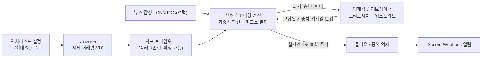

# 나만의 퀀트 트레이딩 신호 어드바이저 — PRD & 작업 계획

**작성일** 2026-07-22 · **버전** v0.2 · **대상 시장** 미국 주식(US Equities) · **작성자** summercamp05

---

## 0. TL;DR

주관적 판단 대신 보조지표 수치만으로 매수/매도 후보 신호를 생성해 **디스코드로 알려주는** 개인용 도구를 만든다. 실제 주문 체결은 사용자가 직접 하며, 시스템은 **백테스트 + 실시간(15~30분 주기) 신호 알림**까지만 담당한다. 보조지표는 특정 종류에 한정하지 않고 **계속 추가 가능한 플러그인형 프레임워크**로 설계하며, 실행은 **PC 전원 상태와 무관하게** 동작해야 한다.

| 항목 | 내용 |
|---|---|
| 목표 | 확장 가능한 보조지표 조합 + 시장 심리 지표로 매수/매도 신호를 계량화하여 알림 |
| 대상 시장 | 미국 주식 (NYSE/NASDAQ 상장 종목) |
| 워치리스트 | 사용자가 직접 추가/삭제, **최대 5종목** |
| 데이터 소스 | yfinance (무료), VIX, 뉴스 감성(무료 티어) |
| 알림 채널 | Discord Webhook (실시간 알림) + 웹 대시보드(GitHub Pages, 조회용) |
| 체크 주기 | 장중 15~30분 간격 |
| 실행 환경 | **GitHub Actions** (확정) — PC가 꺼져 있어도 동작 |
| 임계값 결정 | 고정값이 아닌 **5년 백테스트 기반 캘리브레이션**으로 도출 |
| 자동 주문 실행 | **범위 밖** — 사용자가 수동 실행 |

---

## 1. 배경 및 목표

변동성이 큰 시장에서 감정적 판단을 배제하고, 지표 수치가 특정 기준을 충족할 때만 매수/매도 후보를 기계적으로 걸러내는 것이 목표다. 시스템은 "확신"이 아니라 "후보 신호 + 근거 지표"를 제시하고, 최종 판단과 주문 실행은 사용자가 담당한다.

## 2. 범위 정의

**포함 (In Scope)**
- 사용자가 직접 관리하는 워치리스트(최대 5종목)의 시세/거래량 데이터 수집
- 특정 종류에 한정하지 않는 **확장 가능한 보조지표 프레임워크** (RSI, MACD, 이동평균, 볼린저 밴드, 지지/저항선, 거래량, 피보나치, 일목균형표 등 + 향후 추가)
- VIX, 뉴스 감성 등 시장 심리 지표를 보조 신호로 반영
- 백테스트 기반 신호 스코어링 임계값 캘리브레이션
- 과거 5년 데이터 기반 백테스트 및 성과 리포트
- 디스코드 웹훅을 통한 신호 알림 (장중 15~30분 주기, PC 전원과 무관하게 동작)

**제외 (Out of Scope)**
- 실제 자동 주문 실행/체결 (사용자가 직접 수행)
- 법적 투자자문 제공 — 산출되는 신호는 투자 권유가 아닌 참고용 도구
- 포트폴리오 자금 배분/포지션 사이징 — 후속 단계 검토 대상

## 3. 실행 환경 (확정)

미국 장중 시간(9:30–16:00 ET)은 한국시간 기준 22:30~05:00(서머타임 기준)로, 사용자의 야간 시간대와 겹친다. **PC가 꺼져 있어도 동작해야 한다는 요구사항**에 따라 로컬 스케줄러 방식은 배제하고 **GitHub Actions 스케줄 워크플로**로 확정한다.

- 저장소에 워크플로(`schedule.yml`)를 두고 `on.schedule` cron으로 15~30분 간격 실행
- 디스코드 웹훅 URL 및 뉴스 API 키 등은 GitHub Secrets로 관리(코드에 노출 금지)
- **서머타임 유의점**: GitHub Actions cron은 UTC 고정이라 서머타임 전환 시 실제 미국 동부시간과 어긋날 수 있음 → cron 트리거는 넉넉한 범위로 잡고, 스크립트 내부에서 `America/New_York` 기준 실제 장중 여부를 재검증한 뒤 장 마감 시간대면 조용히 종료하도록 구현
- 워크플로 실패/누락 감지를 위해 실행 로그를 아티팩트로 남기거나 실패 시 별도 알림(선택)

## 4. 워치리스트 및 사용자 설정

- 사용자가 모니터링할 종목을 직접 추가/삭제하는 설정 파일(예: `watchlist.yaml`)로 관리
- 예: `AAPL`을 추가하고 싶다면 설정 파일에 티커 한 줄만 추가하면 파이프라인이 자동으로 반영
- **최대 5종목 제한**: 6번째 종목 추가 시 설정 검증 단계에서 오류를 내고 실행을 막음 (API 호출량 및 알림 빈도 관리 목적)
- 종목별로 개별 캘리브레이션된 가중치·임계값을 저장/관리(9절 참조)

## 5. 시스템 아키텍처



## 6. 데이터 소스 및 제약

- **yfinance**: 무료, API 키 불필요. 1분봉은 최근 7일, 15분/30분봉은 최근 60일까지만 제공. 일봉은 장기간 제공되어 5년 백테스트에 적합.
- **VIX(^VIX)**: yfinance로 공식 경로를 통해 무료로 수집 가능한 시장 변동성/공포 지표. 8절 시장 심리 지표의 1차 채택 소스.
- **Investing.com**: 공식 무료 API 없음. 스크래핑용 `investpy`는 2022년 이후 Cloudflare 보호로 대부분 엔드포인트가 막혀 불안정 — 본 프로젝트에서 채택하지 않음.
- **함의**: 장기 백테스트는 일봉 기준, 실전 신호(15~30분 주기)는 최근 60일 롤링 인트라데이 데이터로 운용하는 이원화 전략이 필요하다.

## 7. 확장 가능한 보조지표 프레임워크

특정 개수에 한정하지 않고, 새로운 보조지표를 계속 추가할 수 있는 **플러그인형 구조**로 설계한다. 각 지표는 공통 인터페이스(예: `compute(df) -> {vote: -1|0|+1, detail}`)를 구현하는 독립 모듈로 작성되고, 설정 파일에 등록만 하면 스코어링 엔진에 자동 반영된다.

**1차 구현 지표 (MVP)**

| 지표 | 목적 | 기본 파라미터 | 매수 신호 예시 | 매도 신호 예시 |
|---|---|---|---|---|
| RSI | 과매수/과매도 판단 | 14봉 | RSI < 30 | RSI > 70 |
| MACD | 추세 전환·모멘텀 | EMA 12/26, 시그널 9 | MACD선이 시그널선 상향 돌파 | MACD선이 시그널선 하향 돌파 |
| 이동평균선 | 추세 방향 | 20/50/200일 | 단기선이 장기선 상향 돌파 | 단기선이 장기선 하향 돌파 |
| 볼린저 밴드 | 변동성/과매수과매도 | 20봉, ±2σ | 하단 밴드 하회 후 재진입 | 상단 밴드 상회 후 재진입 |
| 지지선/저항선 | 주요 가격대 돌파·반등 | 최근 N봉 로컬 고저점 | 저항선 상향 돌파 | 지지선 하향 이탈 |
| 거래량 | 신호 신뢰도 확인(보조) | 20봉 평균 대비 배수 | 평균 대비 1.5배 이상 | 동일 기준 |
| 피보나치 되돌림 | 되돌림 구간 지지/저항 추정 | 스윙 고저 38.2/50/61.8% | 되돌림 구간에서 반등 | 되돌림 구간 이탈 |
| 일목균형표(Ichimoku Cloud) | 추세·모멘텀·지지저항 종합 | 전환선9/기준선26/선행스팬52 | 가격이 구름대 위로 상향 돌파 + 전환선/기준선 골든크로스 | 가격이 구름대 아래로 이탈 + 전환선/기준선 데드크로스 |

**향후 확장 후보** (프레임워크가 지원하는 추가 지표 예시): 스토캐스틱(Stochastic), ADX(추세 강도), OBV(On-Balance Volume), CCI, Williams %R, ATR, 파라볼릭 SAR, VWAP 등. 새 지표는 백테스트로 개별 기여도(단독 승률, 정보계수 등)를 검증한 뒤에만 스코어링 엔진에 편입한다.

## 8. 시장 심리 지표 (Fear & Greed / 뉴스 감성)

기술적 지표 외에 시장 전반의 심리를 보조 신호로 반영하되, 소스별 신뢰성 차이를 고려해 계층화한다.

| 소스 | 성격 | 가용성 | 채택 여부 |
|---|---|---|---|
| CBOE VIX | 정량적 공포 지표, yfinance(`^VIX`)로 공식 수집 | 무료, 안정적 | **채택** — 정량적 공포/탐욕 프록시 |
| CNN Fear & Greed Index | CNN 자체 산출 종합 지수 | 공식 API 없음, 비공식 엔드포인트 스크래핑 필요(투자닷컴과 유사한 단절 리스크) | **미채택(확정, 2026-07-23)** — 단절 리스크 대비 VIX 단일 소스로 단순화 |
| 뉴스 헤드라인 감성 | 종목 관련 뉴스 긍정/부정 톤 | Finnhub 무료 티어(분당 60회) | **채택(확정, 2026-07-23)** — Alpha Vantage(일 25회 제한) 대비 체크 빈도에 여유. 키워드 기반 감성 점수로 시작 |

**설계 원칙**
- VIX는 시장 전체 공포 수준(백분위 기준)을 반영하는 **거시 필터**로 사용 — 예: VIX가 극단적으로 높을 때 매수 임계값을 보수적으로 상향
- 뉴스 감성은 개별 종목 신호의 **보조 확인 지표**로만 사용하고, 소스 장애 시 해당 항목을 자동 제외한 뒤 나머지 지표만으로 스코어링을 지속(단일 장애점 방지)

## 9. 신호 결합 로직 및 임계값 캘리브레이션

- 각 기술적 지표는 매수(+1)/매도(–1)/중립(0) 투표를 하고, 지표별 가중치를 곱해 합산한다.
- 거래량은 단독 투표가 아닌 **신뢰도 배율**로 작동한다.
- VIX·뉴스 감성은 8절의 설계 원칙에 따라 거시 필터/보조 확인으로 최종 스코어에 반영된다.
- **쿨다운**: 동일 종목·동일 방향 신호는 일정 시간 또는 지표 반전 전까지 중복 알림을 억제한다.

**임계값 캘리브레이션 방법론** — 초기 임계값을 고정하지 않고 아래 절차로 백테스트를 통해 도출한다.
1. 최근 5년 데이터를 학습 구간(예: 앞 4년)과 검증 구간(최근 1년)으로 분리
2. 학습 구간에서 지표별 가중치·매수/매도 임계값 조합을 그리드 서치(또는 베이지안 최적화)로 탐색, 목적함수는 샤프비율 등 위험조정수익
3. 검증 구간(홀드아웃)에서 최적 조합의 성과를 재확인해 과최적화 여부 점검
4. 워치리스트 종목별로 캘리브레이션 결과를 개별 저장하고, 정기적으로(예: 분기별) 재캘리브레이션

## 10. 백테스트 설계

- **검증 기간**: 기본 **최근 5년** (사용자 확정)
- **추적 지표**: 누적수익률, CAGR, 최대낙폭(MDD), 샤프비율, 승률, 평균 손익비, 총 거래횟수, 벤치마크(S&P 500 매수후보유) 대비 초과수익
- **기간 이원화**: 장기 검증은 일봉 데이터, 인트라데이 로직 검증은 최근 60일 데이터로 제한적 수행
- **과최적화 경계**: 9절 캘리브레이션 절차에서 학습/검증 구간을 분리하고 결과를 보고서에 명시

## 11. 디스코드 알림 설계

**메시지 예시**
```
BUY 신호 — AAPL
가격: $224.15 (15:32 ET)
근거: RSI 28.4(과매도) · MACD 골든크로스 · 일목구름대 상향 돌파 · 거래량 1.8배
VIX 필터: 중립 (52th pct)
신호 스코어: +5 / 캘리브레이션된 임계값 +4
```

- 필드: 종목, 신호 방향, 현재가·시각, 트리거된 지표 근거, VIX 필터 상태, 스코어/임계값
- 동일 방향 중복 신호는 쿨다운 로직으로 억제(9절)
- 웹훅 URL·API 키는 GitHub Secrets로 관리

## 12. 웹 대시보드 (GitHub Pages)

디스코드 알림은 실시간 푸시용으로 유지하고, 별도로 **조회용 웹 대시보드**를 정적 사이트로 제공한다.

- **역할**: 워치리스트 현황(종목별 최신 지표 값), 최근 신호 히스토리, 백테스트 성과 리포트를 한 페이지에서 조회
- **생성 방식**: GitHub Actions 스케줄 실행마다(15~30분 주기) 최신 데이터로 정적 HTML(+ JSON 데이터 파일)을 생성해 `gh-pages` 브랜치 또는 `docs/`로 배포 — **상시 구동 서버 불필요**, 3절에서 확정한 "PC 전원과 무관하게 동작" 요구사항과 정합적
- **제약**: 실시간 상호작용(예: 웹에서 워치리스트 즉시 수정)은 지원하지 않음 — 워치리스트 수정은 기존과 동일하게 `watchlist.yaml` 커밋으로 반영
- **신호 히스토리 저장**: 알림 발생 시점의 신호 데이터를 리포지토리 내 JSON/CSV 로그(또는 GitHub Actions 아티팩트)로 누적 저장해 대시보드가 과거 이력을 표시할 수 있게 함

## 13. 기술 스택

- Python 3.11+
- `yfinance` — 시세/거래량/VIX 수집
- `pandas` — 지표 계산 (지표 프레임워크의 각 플러그인이 내부적으로 사용). `pandas-ta`는 유지보수가 오래 끊겨 최신 Python 호환 리스크가 있어 채택하지 않고, RSI/MACD 등은 pandas로 직접 구현
- Finnhub 무료 API — 뉴스 감성 (`FINNHUB_API_KEY` 환경변수/GitHub Secrets로 관리)
- `requests` — Discord Webhook 호출
- GitHub Actions — 스케줄 실행(PC 전원 무관) + 대시보드 정적 사이트 생성/배포(12절)
- `pytest` — 지표/백테스트/캘리브레이션 로직 단위 테스트
- 그리드 서치/최적화용 `scikit-learn` 또는 자체 구현

## 14. 마일스톤 / 작업 단계

| 단계 | 내용 | 산출물 | 상태 |
|---|---|---|---|
| Phase 1 | 데이터 파이프라인 + 워치리스트 설정(최대 5종목) + 지표 프레임워크(코어 8종) | yfinance 연동 모듈, 플러그인형 지표 라이브러리 | **완료** (2026-07-23) |
| Phase 2 | 시장 심리 데이터 연동 | VIX 연동, Finnhub 뉴스 감성 연동(장애 시 자동 제외) | **완료** (2026-07-23) |
| Phase 3 | 백테스트 엔진 | 5년 기본 검증, 학습/검증 구간 분리 리포트 | **완료** (2026-07-23) |
| Phase 4 | 임계값 캘리브레이션 파이프라인 | 그리드서치(임계값 1차, 가중치는 확장 가능), 종목별 결과 저장(`calibration/{ticker}.json`) | **완료(1차)** (2026-07-23) — 워크포워드(다중 구간 롤링 검증)는 후속 확장 |
| Phase 5 | 디스코드 알림 + 웹 대시보드 + GitHub Actions 스케줄러 | 웹훅 연동, 쿨다운 로직, `schedule.yml`, 대시보드 정적 사이트 생성/배포(12절) | **완료 및 배포 검증** (2026-07-23) — `github.com/himistu0925/Quant-signal-advisor`, Pages 라이브(`himistu0925.github.io/Quant-signal-advisor`), Secrets 등록 및 Actions 수동 실행 성공 확인 |
| Phase 6 | 페이퍼 트레이딩 검증 및 지표 확장 | 실전 모니터링, 스토캐스틱/ADX/OBV 등 추가 지표 검토 | **지표 확장 1차 완료** (2026-07-23) — 스토캐스틱/ADX/OBV 구현 + 기여도 검증 도구, 실데이터 검증 결과 3종 모두 코어 편입 보류(아래 표). 페이퍼 트레이딩 실전 모니터링은 시간 경과가 필요한 진행형 활동 |

**지표 확장 후보 기여도 검증 결과 (2026-07-23, 5년 데이터, AAPL/MSFT 단 2종목 기준 — 표본 작음, 참고용)**

| 지표 | AAPL IC | AAPL 단독 승률 | MSFT IC | MSFT 단독 승률 | 판단 |
|---|---|---|---|---|---|
| Stochastic | 0.070 | 84.0% (25건) | 0.006 | 54.5% (22건) | 종목별 편차 커서 보류 |
| ADX | -0.121 | 23.8% (21건) | -0.002 | 40.0% (10건) | 예측력 없음(음의 IC) — 편입 안 함 |
| OBV | -0.008 | 44.7% (38건) | -0.028 | 41.0% (39건) | 예측력 없음 — 편입 안 함 |

세 지표 모두 `status="candidate"`로 등록만 해두고 실거래 스코어링(`split_registered()`)에서는 제외했다. 워치리스트 종목이 늘거나 더 긴 기간 검증 후 재평가 가능.

## 15. 리스크 및 면책

- 과최적화(curve-fitting): 백테스트 성과가 실전 성과를 보장하지 않음 — 9절 학습/검증 분리로 완화하나 완전히 제거되지는 않음
- 데이터 지연/제약: 무료 데이터 소스 특성상 약간의 지연 및 인트라데이 기간 제약 존재
- 비공식 소스 단절 위험: CNN F&G 스크래핑, 무료 뉴스 API 한도 변경 등으로 특정 소스가 언제든 끊길 수 있음 → 자동 제외 설계로 대응
- 서머타임/스케줄 오차: GitHub Actions cron이 UTC 고정이라 발생하는 시간대 어긋남(3절 참조)
- 시장 국면 변화: 특정 기간에 최적화된 규칙이 다른 국면에서는 작동하지 않을 수 있음
- 본 시스템은 등록된 투자자문업자가 제공하는 서비스가 아니며, 산출 신호는 참고용일 뿐 투자 권유가 아니다. 자동 주문 실행 기능은 포함하지 않으며, 모든 매매 판단과 실행 책임은 사용자에게 있다.

## 16. 미해결 질문 (확정 필요)

- ~~CNN Fear & Greed 지수의 비공식 스크래핑을 채택할지, 아니면 VIX만으로 단순화할지?~~ → **확정(2026-07-23): VIX만 사용**
- ~~뉴스 감성 API로 Finnhub와 Alpha Vantage 중 어느 것을 사용할지~~ → **확정(2026-07-23): Finnhub**
- 임계값 재캘리브레이션 주기(분기별 vs 월별)는?
- 추가 지표(스토캐스틱/ADX/OBV 등) 도입 우선순위는?
